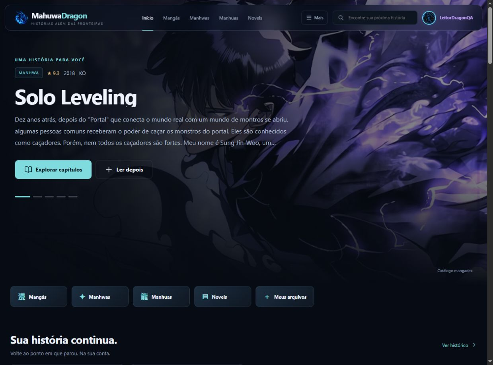

# Mahuwa Dragon

Site de mangás, manhwas, manhuas e novels, com catálogo real, contas, biblioteca, perfis personalizados e tradução ScanDragon integrada ao leitor.



## O que está implementado

- Página inicial com destaques, obras populares, avaliações, atualizações, manhwa, manhua e lançamentos. Organização a partir dos dados das fontes; sem títulos ou capítulos inventados.
- Pesquisa, filtros, paginação, detalhes, lista de capítulos por idioma, qualidade econômica e navegação entre capítulos.
- Leitor contínuo, com páginas ligadas sem faixas entre as imagens, rolagem ou página, direção de leitura, teclado, zoom, tela cheia e retomada do progresso. Leitura automática opcional na barra superior, com velocidade ajustável, pausa e parada ao terminar o capítulo.
- Botões de voltar nas telas internas, preservando a navegação no site. Barras de progresso combinando com o visual para leitura, tradução e importação; carregamentos sem percentual usam uma indicação animada.
- Tradução automática dos capítulos em outros idiomas para português. O motor limpa os pixels das letras reconhecidas e escreve a tradução na imagem. Comparação com o original e editor de texto/áreas permitem corrigir erros.
- OCR local incluído no projeto, com japonês, coreano, chinês e outros idiomas. Tradução básica disponível por melhor esforço; Gemini opcional no servidor, com cotas por usuário e globais.
- Cadastro, login, sessão segura, biblioteca, favoritos, status de leitura e progresso sincronizados com Cloudflare D1. Sem conta, biblioteca e progresso ficam no navegador.
- Perfil com bio, título pessoal, cores, quatro atmosferas, molduras, avatar por GIF do GIPHY ou foto/GIF próprio de até 20 MB com enquadramento. Preserva a imagem original e a animação, com progresso do upload. Perfis privados por padrão.
- Comentários, curtidas, denúncias e remoção pelo autor.
- Importação local de imagens, pastas, ZIP/CBZ e TXT/EPUB. Arquivos permanecem neste dispositivo, inclusive quando o leitor está conectado a uma conta.
- Layout responsivo ocupando a largura da tela, capas grandes, barra superior centralizada e transparente também no leitor, ícones, manifesto, estados de carregamento, tratamento de fontes indisponíveis e proteção de conteúdo inserido por usuários.

## Abrir localmente

Instale Node.js 24 LTS (Node 22.13 ou superior também é compatível), extraia o projeto e abra o terminal na pasta que contém `package.json`:

```sh
npm ci
npm run check
npm test
npm run preview
```

Abra **http://127.0.0.1:8790**. Esse modo usa o Worker real com um adaptador SQLite local. O banco é criado em `.local/` e não faz parte do pacote. As consultas ao catálogo e à tradução básica usam a internet.

Para conferir a tradução sem depender de capítulos externos, abra a história original **A Biblioteca do Dragão**, na seção **Do estúdio Mahuwa Dragon**. Ela contém três páginas em inglês. A novel original também permite testar a tradução de texto.

O modo oficial do ambiente Cloudflare é `npm run dev`. Depois de instalar as dependências, `npm run build` executa a checagem e o dry-run do Wrangler. Veja [a validação realizada](docs/VALIDACAO.md).

## Publicar

Siga [PUBLICAR-CLOUDFLARE.md](docs/PUBLICAR-CLOUDFLARE.md). O projeto usa **Cloudflare Workers + Static Assets + D1**, compatíveis com o plano gratuito dentro das cotas. A publicação está preparada para sua **conta secundária**, sem identificador de conta ou banco de outra pessoa.

O repositório inclui CI e um workflow de publicação manual. Envie o projeto inteiro ao GitHub, incluindo `worker.js`, `server/`, `db/`, `web/`, `wrangler.toml` e os arquivos de dependências. Publicar somente `web/` em GitHub Pages ou como site estático não disponibiliza contas, catálogo ou tradução pelo servidor.

## Fontes e disponibilidade

**MangaDex** fornece o catálogo, capas e capítulos disponibilizados pela própria fonte. API e imagens passam pelo servidor do site. Os grupos e a origem permanecem identificados no leitor. Capítulos que apontam para um publicador externo abrem a publicação original.

**Jikan / MyAnimeList** fornece informações e capas de light novels; não fornece seus capítulos. Para essas obras, use a edição oficial ou importe seu arquivo TXT/EPUB. O site não promete todos os títulos de todos os serviços. Confira [FONTES.md](docs/FONTES.md).

**Tradução:** OCR e limpeza de imagem podem errar em letras estilizadas, balões sobre desenhos e páginas de baixa resolução. O serviço básico é experimental e pode limitar solicitações. Gemini exige sua chave e está sujeito às condições e cotas do provedor. Veja [TRADUCAO.md](docs/TRADUCAO.md).

## Estrutura

```text
web/             interface, leitor, OCR, idiomas e imagens
server/          catálogo, imagens, contas, biblioteca, comunidade, tradução
db/schema.sql    banco D1
worker.js        rotas Cloudflare e limpeza diária de sessões
scripts/         checagens e servidor local
tests/           segurança, integração, tradução e interface
docs/            publicação, fontes, tradução e evidências
.github/         CI e publicação manual na conta secundária
```

O projeto foi adaptado da estrutura do ZIP `Anime_Dragon-main` fornecido pelo usuário: navegação, identidade visual, avatares, perfis e organização Worker/D1. O catálogo de anime e os serviços de vídeo foram substituídos pelo catálogo e leitor de quadrinhos/novels. O nome e a aplicação final são **Mahuwa Dragon**. Nenhuma conta Cloudflare foi acessada ou publicação remota realizada nesta entrega.

As imagens originais já estão geradas. `scripts/assets.mjs` é uma ferramenta opcional para recriá-las e exige o pacote `sharp`; ele não é necessário para executar ou publicar o site.

## Perfil avançado (v1.2)

### Perfil v1.2
- Os avatares prontos foram removidos. Cada conta usa o GIF escolhido no GIPHY, uma foto/GIF enviado pelo usuário ou o avatar neutro enquanto não escolhe nada.
- A tela de perfil foi reorganizada com prévia lateral, bloco de avatar/GIPHY, dados pessoais e personalização visual separados e fáceis de usar.
- A chave `GIPHY_API_KEY` fica somente no Cloudflare Worker. O navegador consulta `/api/giphy/*`; a chave não é enviada ao cliente.
- O Worker valida o ID do GIF no GIPHY antes de gravá-lo no perfil.
- A política CSP permite a mídia e a telemetria oficial do GIPHY sem liberar a API diretamente ao navegador.

O perfil agora aceita nomes com emojis/caracteres Unicode (até 80 caracteres visíveis), bio, privacidade, capa, moldura, cor do nome, avatares locais animados e uma galeria oficial do GIPHY.

### Ativar GIPHY

Crie uma Web API key no painel do GIPHY e configure `GIPHY_API_KEY` nas variáveis do Worker. O navegador consulta o próprio Worker em `/api/giphy/*`; o Worker usa o secret `GIPHY_API_KEY` para falar com a API oficial sem expor a chave. O site mostra a atribuição “Powered By GIPHY”, registra os eventos de analytics fornecidos pela resposta e salva no D1 somente o ID do GIF + enquadramento.

### Ativar Cloudflare R2 para fotos/GIFs enviados

O código funciona sem R2 usando o D1 atual como fallback. Para mover novos uploads automaticamente para object storage, crie um bucket e conecte-o ao Worker com o binding `AVATARS`:

```bash
npx wrangler r2 bucket create mahuwa-dragon-avatars
```

Depois adicione no Cloudflare (ou descomente no `wrangler.toml`):

```toml
[[r2_buckets]]
binding = "AVATARS"
bucket_name = "mahuwa-dragon-avatars"
```

Uploads novos passam a ir para R2; avatares antigos no D1 continuam legíveis. URLs de avatar incluem versão e usam cache longo quando a versão confere.
